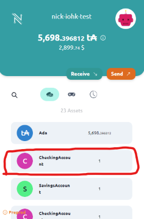

## Roles Guide

The purpose of this guide is to bring together all of the information we have about Roles and Participants in Marlowe.

### Description

Generally speaking, Participants are actors in a Smart Contract. These Participants fulfill Roles that specify the ability to execute certain actions in the contract.

Roles can be hardcoded addresses, pre-determined prior to launching a contract or determined after launching a contract.

```js
// hardcoded
{ address: 'addr_test1qrpmn4mwv5668xf2774xlajxjg6ude5cavsr56pn0dzxdzrql5hfz3tpzvdhkdsuc8p8q0xtztpr58emf9jlgf99xdmq7pkl99'};

// pre-determined prior to launching a contract
const buyer: Party = { address: getFromUI };
{ address: buyer};

// TODO -- Open Roles example here
{ address: OpenRole };
```

These roles are uniquely identified using Role Tokens.

### Role Tokens

devNotes:
1. Did I just have to pay a txn fee to mint Role Tokens? Using checking<>savings in Runner
    - It seems like using Roles in the Runner does cost a Mint txn fee for Role Tokens
    - The TS-SDK does not have a Mint txn fee for Role Tokens. using smart-gift

Role Tokens are used to identify Roles to authorize transactions providing additional security and flexibility for your Smart Contracts. They are handled implicitly by the Marlowe Runtime(verify).


Each participant in a Marlowe contract has a role and each role has its own token. These tokens can be transferred between users in a p2p manner, allowing a participant to give their role to someone else.

There could be one or many tokens for a specific Role.

When hardcoding an address for a participant, role tokens are distributed to addresses at contract initialization. (verify)

When inputing an address from the UI prior to deploying the contract, Role tokens are distributed to addresses at contract initialization (verify)

You can view these Role Tokens in your Wallet under Assets with a name reflective of the name specified for the Role in the Smart Contract.



When designating an address after launching the contract, the Open Roles feature is used. 

### Open Roles

Open Roles allows for the specification of an address after contract deployment that is not known at deployment time.

When using Open Roles, the Marlowe Contract sends the Role tokens to a Validator Script that holds them until you specify an address later, at which time they are sent to the appropriate address.

This feature is best used when a developer is deploying a Smart Contract where certain addresses are unknown. It could be one address or all addresses associated with a contract.

The developer would deploy a contract that could be verified on-chain before a user interacts with it. The user initiates some action, like a deposit or choice, which triggers the Smart Contract to assign them the appropriate role and distribute the Role Token from the Validator Script.

The developer just needs to specify the `{!ts} OpenRoles` type when setting Participants in a contract, the rest is handled behind the scenes by the Marlowe Runtime(verify). Do we also need to 

Because we have now introduced a separate Validator Script to help with our Smart Contract, we need to assign a Thread Token.

#### Thread Tokens

Much like a Role token is tied to a Participant, a Thread Token is tied to a Contract instance.

Thread Tokens are required for the Validator Script to be able to determine which "thread" of Role Tokens to track, where "threads" are instances of a contract.

